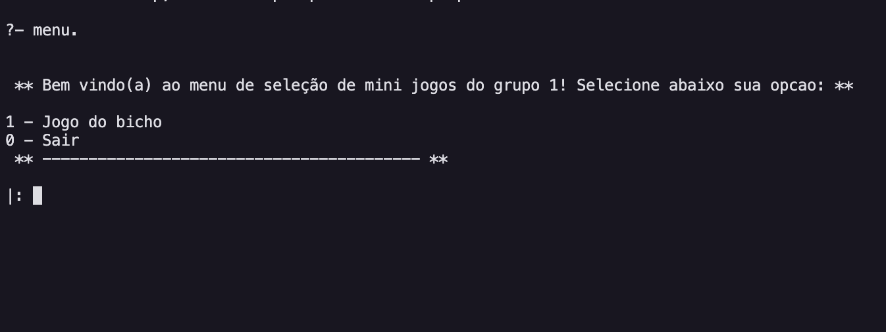
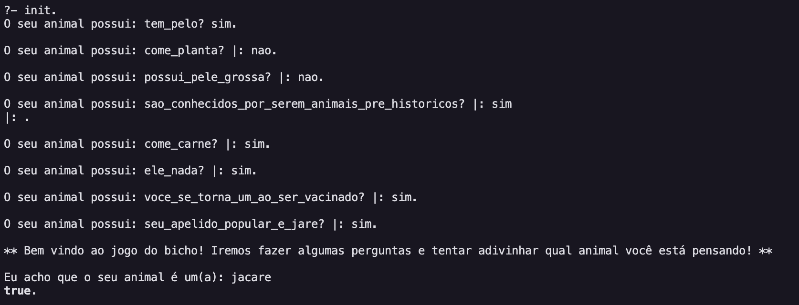

# NomeDoProjeto

**Disciplina**: FGA0210 - PARADIGMAS DE PROGRAMAÇÃO - T02  
**Nro do Grupo**: 01 
**Paradigma**: Lógico 

## Alunos
|Matrícula | Aluno |
| -- | -- |
| 17/0039668  |  Lucas Ganda Carvalho |
| 17/0047326  |  Wictor Bastos Girardi|
## Sobre 
Programa escrito em Prolog com tema de jogo de adivinhação de animais. Ao iniciar o jogo o usúario é questionado sobre diversas perguntas e irá tentar adivinhar o animal que o usuário está pensando.

## Screenshots

## Instalação 
**Linguagens**: Prolog 
**Tecnologias**: Prolog 
Descreva os pré-requisitos para rodar o seu projeto e os comandos necessários.
Insira um manual ou um script para auxiliar ainda mais.

## Uso 
- Clone o repositório.
- Abra o terminal dentro do diretório da pasta.
- De o comando:  swipl menu.pl
- Depois para acessar o menu: menu.
- escolha uma opção, por ex: (1).
- para entrar no game: init.
- sim ou nao para as respostas.

## Vídeo
Adicione 1 ou mais vídeos com a execução do projeto.

## Fontes
Caso utilize materiais de terceiros, referencie-os adequadamente.
